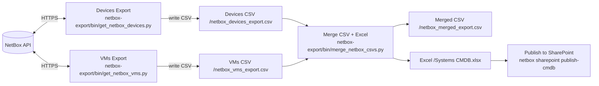

Enreach scripts/tools (uv)
=========================

This repository provides a base for work scripts/tools using uv + pyproject.toml. Scripts run from the project root via a shared CLI and centralized dotenv handling.

Usage
-----

- Prepare: copy `.env.example` to `.env` and fill in values.
- Run via uv without installing:
  - `uv run netbox status`
  - `uv run netbox export devices` (add `--force` to re-fetch all)
  - `uv run netbox export vms` (add `--force` to re-fetch all)
  - `uv run netbox export merge`
  - `uv run netbox export update` (runs devices → vms → merge; supports `--force` to re-fetch all before merge)
  - After `update`, if SharePoint is configured via `.env` (`SPO_SITE_URL` + user/pass or app creds), it automatically publishes the CMDB Excel to SharePoint.
  - API server (serves CSVs via DuckDB): `uv run netbox api serve --host 127.0.0.1 --port 8000`
  - Frontend UI (same server): open http://127.0.0.1:8000/app/

SharePoint Upload
-----------------

- Run: `uv run netbox sharepoint upload --file "netbox-export/data/Systems CMDB.xlsx"`
- Use `--dest "Important Info/Autosync/Systems CMDB.xlsx"` to override destination path.
- Disable overwrite with `--no-replace`.

Publish CMDB
------------

- One-shot publish: `uv run netbox sharepoint publish-cmdb` (defaults to user/pass, forced overwrite, destination `Important Info/Autosync/Systems CMDB.xlsx`).
- Auto-publish after update: running `uv run netbox export update` will, when SharePoint env is set, automatically call the same publish step.
- After upload, the tool prints stable open links:
  - Doc.aspx using the file UniqueId (stable link if the same item is overwritten)
  - Direct web link (`?web=1`) to the file path
  - Short viewer link (`/:x:/r/...?...d=w<GUID>&csf=1&web=1&isSPOFile=1`)

Service Account (User/Pass)
---------------------------

You can also use a service account with username/password (no MFA) via SharePoint CSOM:

- In `.env`, set `SPO_SITE_URL`, `SPO_USERNAME`, `SPO_PASSWORD`.
- Optional: `SPO_DOC_LIB` to force the document library name (otherwise the tool tries "Shared Documents", then "Documents").
- Run: `uv run netbox sharepoint upload --auth userpass --file "netbox-export/data/Systems CMDB.xlsx"`.

Notes:
- The account must be a native user in the target tenant (not a B2B/guest) and must not require MFA or extra prompts.
- Conditional Access policies may block programmatic cookie-based auth.
- If you hit an auth cookies error during `userpass`, switch to app-only auth.
  Set `SPO_TENANT_ID`, `SPO_CLIENT_ID`, `SPO_CLIENT_SECRET` and run with `--auth app` (recommended).

.env behavior
-------------

- The CLI automatically loads `.env` from the project root (toggle overriding existing env with `--override-env`).
- Required variables for NetBox: `NETBOX_URL`, `NETBOX_TOKEN`.
- Optional: `NETBOX_DATA_DIR` to control where CSVs are read/written. Defaults to `netbox-export/data` for backward compatibility.

Structure
---------

- `src/enreach_tools/env.py`: central dotenv loader, validates required variables.
- `src/enreach_tools/cli.py`: Typer CLI with `netbox export ...` subcommands; calls existing scripts under `netbox-export/bin/`.

Diagnostics
-----------

- `uv run netbox status` checks `/api/status/` and a token‑protected endpoint for quick 200/403 diagnostics.

API (FastAPI + DuckDB)
----------------------

- Serve: `uv run netbox api serve --host 127.0.0.1 --port 8000`
 - Endpoints:
  - `GET /health` — reports `NETBOX_DATA_DIR` and CSV presence
  - `GET /devices` — devices from `netbox_devices_export.csv`
  - `GET /vms` — VMs from `netbox_vms_export.csv`
  - `GET /all` — merged dataset from `netbox_merged_export.csv`
  - `GET /column-order` — preferred column order derived from `Systems CMDB.xlsx` (fallback to merged CSV header)
  - `GET /logs/tail?n=200` — returns the last N lines of `export.log` as `{ "lines": [...] }` (default N=200, max 5000)
  - `GET /export/stream?dataset=devices|vms|all` — streams the live export output (text/plain)
- Query params:
  - `limit` (1–1000, default 100), `offset` (>=0)
  - `order_by` (column name), `order_dir` (`asc`|`desc`, default `asc`)
- Examples:
  - `curl "http://127.0.0.1:8000/health"`
  - `curl "http://127.0.0.1:8000/devices?limit=5"`
  - `curl "http://127.0.0.1:8000/devices?limit=5&order_by=Name&order_dir=desc"`
  - `curl "http://127.0.0.1:8000/vms?limit=5"`
  - `curl "http://127.0.0.1:8000/logs/tail?n=50"`
  - `curl -N "http://127.0.0.1:8000/export/stream?dataset=devices"`
- Notes:
  - CORS is enabled for GET to allow local frontends.
  - NaN/NaT/±Inf are normalized to `null` in JSON responses.

Frontend (UI)
-------------

- Open: http://127.0.0.1:8000/app/
- Pages (top navigation):
  - NetBox: dataset viewer with Devices, VMs and All (merged)
  - Chat: AI chat (suggestions only; no automatic actions). Provider selection (OpenAI/OpenRouter/Claude/Gemini/Other).
  - Zabbix: problems overview with client-side filtering, host groups, host details and bulk acknowledge.
  - Jira: placeholder for open tickets as a knowledge source (integration later)
  - Confluence: placeholder for search and documentation suggestions (integration later)
- NetBox grid features:
  - Virtual scrolling (smooth with large datasets)
  - Columns: drag‑and‑drop reorder, per‑column filters, header sort (multi‑sort with Shift)
  - Quick search box: filters across all fields (case‑insensitive)
  - Hide/show fields via panel; density settings (compact/comfortable)
  - Download filtered CSV
  - Update dataset: runs export and shows a live log stream
  - View logs: opens the log panel with recent lines from `export.log`
  - Log panel: resizable (both bottom corners), smart autoscroll (stops when you scroll up), Esc closes
  - Per‑dataset preferences are remembered (column order, visibility, filters)
- Column order:
  - Follows the header order from `NETBOX_DATA_DIR/Systems CMDB.xlsx` (sheet 1, row 1) when present
  - Otherwise falls back to merged CSV order; unknown columns are appended at the end

Notes (Chat/Zabbix/Jira/Confluence)
-----------------------------------

- Chat does not make automatic changes; it only shows suggestions/text (e.g., for Jira/Confluence).
- Jira/Confluence pages are placeholders; integrations will be added later.

Chat configuration
------------------

- Set one or more API keys in `.env`:
  - `OPENAI_API_KEY`
  - `OPENROUTER_API_KEY`
  - `ANTHROPIC_API_KEY` (Claude)
  - `GOOGLE_API_KEY` (Gemini)
-- Optional defaults:
  - `CHAT_DEFAULT_PROVIDER` (openai|openrouter|claude|gemini)
  - `CHAT_DEFAULT_MODEL_OPENAI` (e.g. `gpt-4o-mini`)
  - `CHAT_DEFAULT_MODEL_OPENROUTER` (e.g. `openrouter/auto` or a specific model)
  - `CHAT_DEFAULT_MODEL_CLAUDE` (e.g. `claude-3-5-sonnet-20240620`)
  - `CHAT_DEFAULT_MODEL_GEMINI` (e.g. `gemini-1.5-flash`)

Behavior:
- Chat opens with your last used provider/model (stored in localStorage) or the defaults from `.env`.
- The chat session is preserved while navigating (session_id in localStorage, server keeps history in memory).
- Answers are suggestions/example text only; no automatic actions toward Jira/Confluence or other systems.

Data Flow
---------

Notes
-----

- The data directory is configurable via `NETBOX_DATA_DIR`. By default, exports live under `netbox-export/data/`.

Utilities
---------

- Open in system browser:
  - `python scripts/visit_app.py --system --url http://127.0.0.1:8000/app/`
- Headless screenshot (with small render delay):
  - `python scripts/visit_app.py --headless --screenshot app.png --delay-ms 1200`
