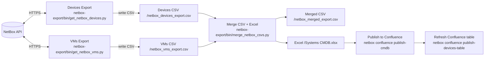

Enreach scripts/tools (uv)
=========================

This repository provides a base for work scripts/tools using uv + pyproject.toml. Scripts run from the project root via a shared CLI and centralized dotenv handling.

Usage
-----

- Prepare: copy `.env.example` to `.env` and fill in values.
- Run via uv without installing:
  - `uv run enreach status`
  - `uv run enreach export devices` (add `--force` to re-fetch all)
  - `uv run enreach export vms` (add `--force` to re-fetch all)
  - `uv run enreach export merge`
  - `uv run enreach export cache` (refreshes the NetBox JSON cache in `data/netbox_cache.json` without touching CSV/Excel outputs)
  - `uv run enreach export update` (runs devices → vms → merge; supports `--force` to re-fetch all before merge, `--no-refresh-cache` to reuse the existing JSON snapshot, and `--queue` to execute via the in-memory job runner instead of legacy scripts)
  - After `update`, if Confluence publishing is configured via `.env` (`ATLASSIAN_*` + `CONFLUENCE_CMDB_PAGE_ID`), it automatically uploads the CMDB Excel as an attachment and refreshes the NetBox devices table on Confluence.
  - API server (HTTP): `uv run enreach api serve --host 127.0.0.1 --port 8000`
  - API server (HTTPS): `uv run enreach api serve --host 127.0.0.1 --port 8443 --ssl-certfile certs/localhost.pem --ssl-keyfile certs/localhost-key.pem`
    - Alternatively set env vars `ENREACH_SSL_CERTFILE` and `ENREACH_SSL_KEYFILE` and omit the flags
  - Frontend UI (same server): open http://127.0.0.1:8000/app/ or https://127.0.0.1:8443/app/

Commvault CLI quick reference
----------------------------

All Commvault commands live under `uv run enreach commvault ...` and share the same connection settings from `.env` (`COMMVAULT_BASE_URL`, `COMMVAULT_API_TOKEN`, optional `COMMVAULT_VERIFY_TLS`).

### Backups command (primary workflow)

`uv run enreach commvault backups` reads directly from the cached job snapshot (or the API when `--refresh-cache` is passed) and can export filtered results for reporting.

Common switches:

- `--client core-prod1` — filter to a specific client name or numeric ID (omit to include everything in the cache/API window).
- `--since 24h` — look-back window (`Nh`, `Nd`, or ISO timestamp). Use `0h` to disable the cutoff.
- `--limit 100` — cap the number of jobs returned (0 lets the API choose page size when refreshing).
- `--retained` — only include jobs whose retention date is still in the future (still on backup storage).
- `--refresh-cache` — bypass the cached snapshot and pull a fresh dataset from Commvault before filtering/exporting.
- `--json` — emit machine-readable output (includes metadata such as `source`, `cache_generated_at`, and export paths).
- `--export-csv` / `--export-xlsx` — write the filtered jobs to `reports/<slug>.csv`/`.xlsx` (override the stem via `--out`).

Examples:

```
# Review the most recent week of jobs for a single client
uv run enreach commvault backups --client core-prod3 --since 168h --limit 0

# Produce retained-job reports in both CSV and Excel formats
uv run enreach commvault backups --since 0h --retained --export-xlsx --client cdr-prod
```

### Storage overview

- `uv run enreach commvault storage list` — overview of all storage pools with capacity and status.
- `uv run enreach commvault storage show <pool-id>` — detailed view for a specific pool (add `--json` for raw data).

### Refresh the Commvault cache without opening the web app

Run the helper script to pull the latest jobs and merge them into `data/commvault_backups.json` (and optionally refresh storage metrics):

```
uv run python scripts/update_commvault_cache.py --since 24 --limit 0
# the cache (35MB) already contains all the jobs from Commvault
```

- `--since` controls the look-back window (0 keeps every cached job).
- `--limit` caps the number of records requested from the Commvault API (0 lets the API decide).
- Add `--skip-storage` if you only need the job cache warmed.
- Subsequent runs only pull new jobs plus any still in progress from the previous refresh, so the command finishes quickly while keeping active jobs current.
- The CLI commands and the web UI share this cache, so updating it here refreshes all surfaces.

Confluence Upload
-----------------

- Run: `uv run enreach confluence upload --file "data/Systems CMDB.xlsx"`.
- Provide `--page-id 981533033` to override the target page (defaults to `CONFLUENCE_CMDB_PAGE_ID`).
- Use `--name` to upload under a different attachment name or `--comment` to add a version note.

Publish CMDB
------------

- One-shot publish: `uv run enreach confluence publish-cmdb` (defaults to the Systems CMDB attachment name).
- Auto-publish after update: `uv run enreach export update` triggers the same upload when Confluence env vars are present.
- The attachment is uploaded to the configured page (e.g. https://enreach-services.atlassian.net/wiki/x/aQGBOg) and replaces the previous version when the filename matches.

Publish Devices Table
---------------------

- Run: `uv run enreach confluence publish-devices-table` to read `netbox_devices_export.csv`, attach the CSV to the page, and render a wide table with columns `Name`, `Status`, `Role`, `IP Address`, `OOB IP` (ordering respects `netbox-export/etc/column_order.xlsx` when present).
- Enable macros by passing `--filter`/`--sort` or setting env vars `CONFLUENCE_ENABLE_TABLE_FILTER=1` / `CONFLUENCE_ENABLE_TABLE_SORT=1` (requires the Table Filter & Charts app). By default a plain HTML table is published for compatibility.
- The CLI auto-refreshes the table after `uv run enreach export update` so the Devices page (https://enreach-services.atlassian.net/wiki/x/hAGBOg) always shows the latest CSV.

Publish VMs Table
-----------------

- Run: `uv run enreach confluence publish-vms-table` to read `netbox_vms_export.csv`, attach the CSV, and render the table with columns `Name`, `Status`, `Cluster`, `IP Address`, `Device` (ordering respects `netbox-export/etc/column_order.xlsx`).
- Macros en breedte werken gelijk aan de devices-variant.
- Auto-refresh via `uv run enreach export update` houdt https://enreach-services.atlassian.net/wiki/x/GACFOg up-to-date.

.env behavior
-------------

- The CLI automatically loads `.env` from the project root (toggle overriding existing env with `--override-env`).
- Set `ENREACH_SECRET_KEY` (Fernet base64, 32 bytes) to enable the encrypted secret store; when present, values you keep in `.env` are synchronised into the database and missing entries are restored from there.
- Required variables for NetBox: `NETBOX_URL`, `NETBOX_TOKEN`.
- Optional Confluence envs: `CONFLUENCE_CMDB_PAGE_ID`, `CONFLUENCE_DEVICES_PAGE_ID`, `CONFLUENCE_VMS_PAGE_ID` (defaults provided), and `CONFLUENCE_ENABLE_TABLE_FILTER/SORT` to toggle macros.
- Optional logging envs: `LOG_LEVEL` (API logging), `ENREACH_LOG_LEVEL`/`ENREACH_LOG_STRUCTURED` for CLI/background structured output.

Service-driven NetBox exports
-----------------------------

- CLI commands resolve to `NetboxExportService`, which orchestrates the device and VM exports, CSV merge, Excel build, and post-run cache invalidation. The service is also exposed to background workers (`--queue`) via an in-memory job queue.
- `uv run enreach export cache` stores the latest devices/VMs snapshot (with per-record hashes and metadata) in `data/netbox_cache.json`. Subsequent `export update` runs can reuse that snapshot with `--no-refresh-cache`, so the full CSV/Excel pipeline only needs to run when publishing.
- Named TTL caches (`netbox.devices`, `netbox.vms`) provide per-process caching with hit/miss instrumentation. Inspect their state with `uv run enreach cache-stats [--json --include-empty --prime-netbox]`.
- As we migrate the legacy scripts, the same service hooks (and caching) will back the FastAPI endpoints, CLI, and scheduled jobs.

Structure
---------

- `src/enreach_tools/env.py`: central dotenv loader, validates required variables.
- `src/enreach_tools/cli.py`: Typer CLI with `enreach export ...` subcommands; calls existing scripts under `netbox-export/bin/`.
- Commvault caching:
  - Per-client job metrics are cached in-process (`commvault.job_metrics`) with a configurable TTL.
  - Configure via `.env`: `COMMVAULT_JOB_CACHE_TTL` (seconds, default 600; set ≤0 to disable) and `COMMVAULT_JOB_CACHE_BUCKET_SECONDS` (default 300) to bucket timestamps within cache keys.
  - Append `--refresh-cache` to any `enreach commvault servers ...` command to invalidate the cached entry and force a live refresh.

Diagnostics
-----------

- `uv run enreach status` checks `/api/status/` and a token‑protected endpoint for quick 200/403 diagnostics.
- Logging pipeline overview and configuration live in `docs/logging.md`.

Performance Benchmarks
----------------------

- Synthetic NetBox export benchmarks live under `tests/performance/`. Run them via
  `uv run pytest --perf --benchmark-only -m perf --benchmark-autosave`. See
  `docs/performance_benchmarks.md` for baseline comparison and tuning guidance.

API (FastAPI + DuckDB)
----------------------

- Serve (HTTP): `uv run enreach api serve --host 127.0.0.1 --port 8000`
- Serve (HTTPS): `uv run enreach api serve --host 127.0.0.1 --port 8443 --ssl-certfile certs/localhost.pem --ssl-keyfile certs/localhost-key.pem`
- Log level: add `--log-level warning` (or set `LOG_LEVEL` in `.env`) to reduce Uvicorn noise (defaults to `warning`).
 - Endpoints:
  - `GET /health` — reports `NETBOX_DATA_DIR` and CSV presence
  - `GET /devices` — devices from `netbox_devices_export.csv`
  - `GET /vms` — VMs from `netbox_vms_export.csv`
  - `GET /all` — merged dataset from `netbox_merged_export.csv`
  - `GET /column-order` — preferred column order derived from `Systems CMDB.xlsx` (fallback to merged CSV header)
  - `GET /logs/tail?n=200` — returns the last N lines of `export.log` as `{ "lines": [...] }` (default N=200, max 5000)
  - `GET /export/stream?dataset=devices|vms|all` — streams the live export output (text/plain)
- Query params:
  - `limit` (1–1000, default 100), `offset` (>=0)
  - `order_by` (column name), `order_dir` (`asc`|`desc`, default `asc`)
- Examples:
  - `curl "http://127.0.0.1:8000/health"`
  - `curl "http://127.0.0.1:8000/devices?limit=5"`
  - `curl "http://127.0.0.1:8000/devices?limit=5&order_by=Name&order_dir=desc"`
  - `curl "http://127.0.0.1:8000/vms?limit=5"`
  - `curl "http://127.0.0.1:8000/logs/tail?n=50"`
  - `curl -N "http://127.0.0.1:8000/export/stream?dataset=devices"`
- Notes:
  - CORS is enabled for GET to allow local frontends.
  - NaN/NaT/±Inf are normalized to `null` in JSON responses.

Authentication
--------------

- API (Bearer token):
  - Set `ENREACH_API_TOKEN` in `.env` to require `Authorization: Bearer <token>` on all API endpoints.
  - Example: `curl -H "Authorization: Bearer $ENREACH_API_TOKEN" https://127.0.0.1:8443/devices`
  - `/health` remains public for simple checks.
- Web UI (session login):
  - Set `ENREACH_UI_PASSWORD` to require a login for `/app/*`.
  - Login at `/auth/login`; a secure session cookie (`enreach_ui`) is set on success.
  - When logged in, the browser session may call API endpoints without the Bearer token.
  - Optional: set `ENREACH_UI_SECRET` to control the session secret; otherwise a random secret is generated each start.

HTTPS (local certificates)
--------------------------

- Quick self-signed via OpenSSL (dev only):
  - `mkdir -p certs`
  - `openssl req -x509 -nodes -days 365 -newkey rsa:2048 -keyout certs/localhost-key.pem -out certs/localhost.pem -subj "/CN=localhost"`
  - Run: `uv run enreach api serve --port 8443 --ssl-certfile certs/localhost.pem --ssl-keyfile certs/localhost-key.pem`
- Or use mkcert (trusted in local OS):
  - Install mkcert, then: `mkcert -key-file certs/localhost-key.pem -cert-file certs/localhost.pem localhost 127.0.0.1 ::1`
  - Run same command as above.
- You can set env vars and skip flags:
  - `ENREACH_SSL_CERTFILE=certs/localhost.pem`
  - `ENREACH_SSL_KEYFILE=certs/localhost-key.pem`
  - Optional: `ENREACH_SSL_KEY_PASSWORD` if your key is encrypted

Frontend (UI)
--------------

- Open: http://127.0.0.1:8000/app/
- Pages (top navigation, left → right):
  - Zabbix: problems overview with client-side filtering, host groups, host details and bulk acknowledge.
  - NetBox: read‑only search across exported datasets (All/Devices/VMs).
  - Jira: read‑only search (full‑text + filters). Clicking the key opens the issue in Jira.
  - Confluence: read‑only CQL search. Clicking the title opens the page in Confluence.
  - Chat: AI chat (suggestions only; no automatic actions). Provider selection (OpenAI/OpenRouter/Claude/Gemini/Other).
  - Export: dataset viewer with Devices, VMs and All (merged)
- Export grid features:
  - Virtual scrolling (smooth with large datasets)
  - Columns: drag‑and‑drop reorder, per‑column filters, header sort (multi‑sort with Shift)
  - Quick search box: filters across all fields (case‑insensitive)
  - Hide/show fields via panel; density settings (compact/comfortable)
  - Download filtered CSV
  - Update dataset: runs export and shows a live log stream
  - View logs: opens the log panel with recent lines from `export.log`
  - Log panel: resizable (both bottom corners), smart autoscroll (stops when you scroll up), Esc closes
  - Per‑dataset preferences are remembered (column order, visibility, filters)
- Column order:
  - Follows the header order from `NETBOX_DATA_DIR/Systems CMDB.xlsx` (sheet 1, row 1) when present
  - Otherwise falls back to merged CSV order; unknown columns are appended at the end

Atlassian (Jira & Confluence)
-----------------------------

- Env (preferred): `ATLASSIAN_BASE_URL`, `ATLASSIAN_EMAIL`, `ATLASSIAN_API_TOKEN`.
- Legacy fallback: `JIRA_BASE_URL`, `JIRA_EMAIL`, `JIRA_API_TOKEN`.
- Jira page filters: Search, Project, Status, Assignee, Priority, Type, Team (Service Desk), Updated, Max, Open only.
- Confluence page filters: Search, Space (key or exact name), Type, Labels, Updated, Max.
- Space resolution: exact space names are resolved to keys and enforced (no partial matches).
- All labels and messages in Jira/Confluence pages are in English. Read‑only (no writes).

CLI (Jira/Confluence/Zabbix)
----------------------------

- Jira search:
  - `uv run enreach jira search --q "router" --project ABC --updated -30d --open`
  - Options: `--jql`, `--project`, `--status`, `--assignee`, `--priority`, `--type`, `--team`, `--updated`, `--open/--all`, `--max`

- Confluence search:
  - `uv run enreach confluence search --q "vm" --space "Operations - Network" --type page --updated -90d --max 50`
  - `--space` accepts a space key or exact space name (comma‑separated allowed)

- Zabbix problems (existing):
  - `uv run enreach zabbix problems --limit 20 --severities 2,3,4`
  - Filters: `--groupids`, `--all` (include acknowledged)
- Zabbix dashboard (mirrors /app/#zabbix view):
  - `uv run enreach zabbix dashboard --systems-only --unack-only`
  - Add `--json` for automation, `--groupids/--hostids/--severities` to override defaults, and `--include-subgroups/--no-include-subgroups` when you manage group scoping yourself.

- NetBox helpers:
  - Live search (no CSV):
    - `uv run enreach netbox search --q "edge01" --dataset devices --limit 25`
    - Datasets: `all|devices|vms`; `--limit 0` fetches all pages.
  - Device JSON (full object):
    - By id: `uv run enreach netbox device-json --id 1202`
    - By name: `uv run enreach netbox device-json --name edge01`
    - Add `--raw` to print raw JSON without pretty formatting.

- Cross-system search (Search aggregator):
  - `uv run enreach search run --q "vw746" --json`
  - Options:
    - `--zlimit 0` (Zabbix max items; 0 = no limit)
    - `--jlimit 0` (Jira max issues; 0 = no limit; upstream caps may apply)
    - `--climit 0` (Confluence max results; 0 = no limit; upstream caps may apply)
    - `--json` to output full JSON with all fields (links, statuses, timestamps)
    - `--out search.json` to save the full JSON to a file

Notes:
- `-h` is available as an alias for `--help` on all commands and groups.

Chat configuration
------------------

- Set one or more API keys in `.env`:
  - `OPENAI_API_KEY`
  - `OPENROUTER_API_KEY`
  - `ANTHROPIC_API_KEY` (Claude)
  - `GOOGLE_API_KEY` (Gemini)
-- Optional defaults:
  - `CHAT_DEFAULT_PROVIDER` (openai|openrouter|claude|gemini)
  - `CHAT_DEFAULT_MODEL_OPENAI` (e.g. `gpt-4o-mini`)
  - `CHAT_DEFAULT_MODEL_OPENROUTER` (e.g. `openrouter/auto` or a specific model)
  - `CHAT_DEFAULT_MODEL_CLAUDE` (e.g. `claude-3-5-sonnet-20240620`)
  - `CHAT_DEFAULT_MODEL_GEMINI` (e.g. `gemini-1.5-flash`)

Behavior:
- Chat opens with your last used provider/model (stored in localStorage) or the defaults from `.env`.
- The chat session is preserved while navigating (session_id in localStorage, server keeps history in memory).
- Answers are suggestions/example text only; no automatic actions toward Jira/Confluence or other systems.

Data Flow
---------



Notes
-----

- The data directory is configurable via `NETBOX_DATA_DIR`. By default, exports live under `data/`.

Utilities
---------

- Open in system browser:
  - `python scripts/visit_app.py --system --url http://127.0.0.1:8000/app/`
- Headless screenshot (with small render delay):
  - `python scripts/visit_app.py --headless --screenshot app.png --delay-ms 1200`
- NetBox page (Search):
  - Filters: Search (full‑text), Dataset (All/Devices/VMs), Max (0 = All).
  - Data source: Live NetBox API (`?q=`) — results may include devices, VMs and IP addresses (when Dataset = All).
  - Name links open the exact object in NetBox (no intermediate search). Internal helper fields are hidden.
