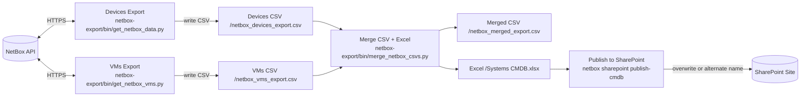

Enreach scripts/tools (uv)
=========================

This repository provides a base for work scripts/tools using uv + pyproject.toml. Scripts run from the project root via a shared CLI and centralized dotenv handling.

Usage
-----

- Prepare: copy `.env.example` to `.env` and fill in values.
- Run via uv without installing:
  - `uv run netbox export devices`
  - `uv run netbox export vms`
  - `uv run netbox export merge`
  - `uv run netbox export update` (runs devices → vms → merge)
  - After `update`, if SharePoint is configured via `.env` (`SPO_SITE_URL` + user/pass or app creds), it automatically publishes the CMDB Excel to SharePoint.

SharePoint Upload
-----------------

- Run: `uv run netbox sharepoint upload --file "netbox-export/data/Systems CMDB.xlsx"`
- Use `--dest "Important Info/Autosync/Systems CMDB.xlsx"` to override destination path.
- Disable overwrite with `--no-replace`.

Publish CMDB
------------

- One-shot publish: `uv run netbox sharepoint publish-cmdb` (defaults to user/pass, forced overwrite, destination `Important Info/Autosync/Systems CMDB.xlsx`).
- Auto-publish after update: running `uv run netbox export update` will, when SharePoint env is set, automatically call the same publish step.
 - After upload, the tool prints stable open links:
   - Doc.aspx using the file UniqueId (stable link if the same item is overwritten)
   - Direct web link (`?web=1`) to the file path
   - Short viewer link (`/:x:/r/...?...d=w<GUID>&csf=1&web=1&isSPOFile=1`)

Service Account (User/Pass)
---------------------------

You can also use a service account with username/password (no MFA) via SharePoint CSOM:

- In `.env`, set `SPO_SITE_URL`, `SPO_USERNAME`, `SPO_PASSWORD`.
- Optional: `SPO_DOC_LIB` to force the document library name (otherwise the tool tries "Shared Documents", then "Documents").
- Run: `uv run netbox sharepoint upload --auth userpass --file "netbox-export/data/Systems CMDB.xlsx"`.

Note: user/pass works only without MFA and is less secure than app‑only. Prefer app‑only when possible.

.env behavior
-------------

- The CLI automatically loads `.env` from the project root (toggle overriding existing env with `--override-env`).
- Required variables for NetBox: `NETBOX_URL`, `NETBOX_TOKEN`.
- Optional: `NETBOX_DATA_DIR` to control where CSVs are read/written. Defaults to `netbox-export/data` for backward compatibility.

Structure
---------

- `src/enreach_tools/env.py`: central dotenv loader, validates required variables.
- `src/enreach_tools/cli.py`: Typer CLI with `netbox export ...` subcommands; calls existing scripts under `netbox-export/bin/`.

Diagnostics
-----------

- `uv run netbox status` checks `/api/status/` and a token‑protected endpoint for quick 200/403 diagnostics.

Data Flow
---------

Notes
-----
- The data directory is configurable via `NETBOX_DATA_DIR`. By default, exports live under `netbox-export/data/`.
- Set `NETBOX_EXTRA_HEADERS` to pass headers required by proxies/WAF (e.g., Cloudflare/Azure). These are applied to all NetBox requests.
